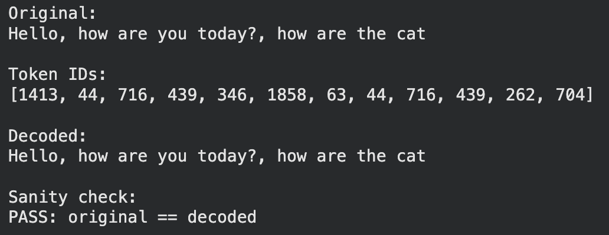

# BPE-tokenizer
A naive implementation of BPE tokenizer. Implementation include pretokens calculations, chunking, pairing, merging and training Tokenizer class.

## Examples Tokens created on TinyDataset. 

### Longest tokens
```text
6428 15 b' accomplishment'
8046 15 b' responsibility'
9057 15 b' disappointment'
9711 15 b' recommendation'
3614 14 b' uncomfortable'
3826 14 b' compassionate'
4862 14 b' understanding'
5693 14 b' neighbourhood'
6231 14 b' Unfortunately'
```
### Shortest tokens
```text
256 2 b'he'
257 2 b' t'
258 2 b' a'
259 2 b' s'
260 2 b' w'
261 2 b'nd'
263 2 b'ed'
266 2 b' b'
267 2 b'in'
268 2 b' h'
270 2 b're'
271 2 b'ou'
```

## Tokenizing text and Checking
<p align="center">
  
</p>

## Algorithms
1. chunking
2. counting pretokens
3. counting pairs
4. merging sequence 


